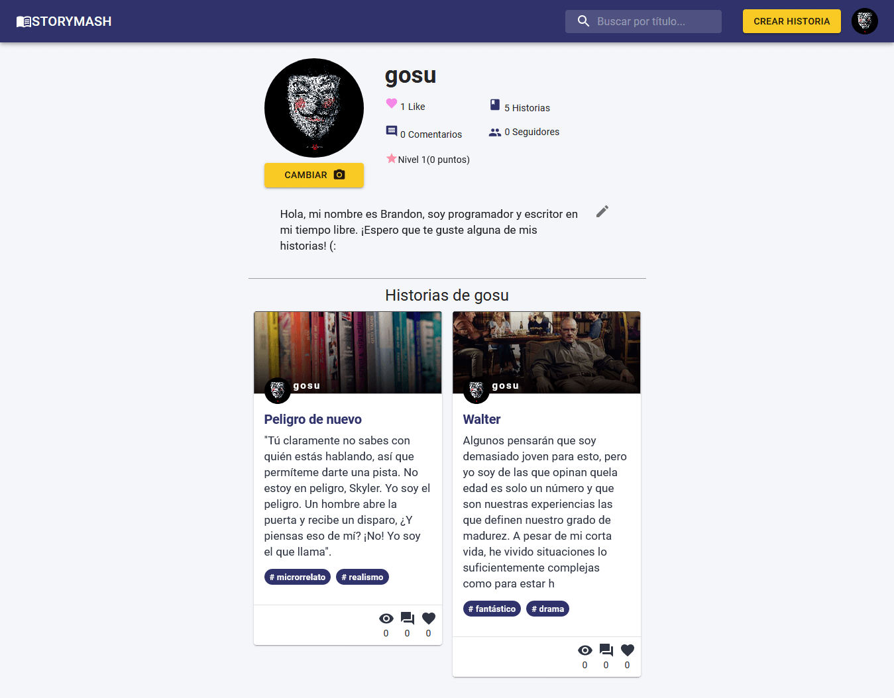

# StoryMash (NOT COMPLETED)

This is a basic social network app using Javascript Technologies like Nodejs, Mongodb, React, and so on.
This app can:

- Allows a user to do log in and look his profile and other users profile
- Allows a user to follow/unfollow to other user
- Allows a user to edit his profile (image / about)
- Allows a user create/read/update/delete a story
- Allows a user create/read/update/delete a continuation of his story
- Allows a user to add/remove favorites stories from their favorites
- Allows a user to create/read/update/delete story comments

## Installation:

Make sure you have Node and NPM installed.

```bash
git clone https://github.com/brandon-gs/storybox
cd storybox
npm install
```

Create an env file like the next

```
MONGODB_URI=mongodb://localhost/storymash
JWT_SECRET=MY_SECRET
API_SECRET=MY_API_SECRET
CLOUDINARY_API_KEY=123123123
CLOUDINARY_API_SECRET=123123123
CLOUDINARY_CLOUD_NAME=name_cloudinary
```

### Starting the app:

```bash
# Run in dev mode:
npm run dev

# Run in production:
npm run build
npm start
```

## Screenshot




## Technologies

- Typescript
- Node
- MongoDB
- Express
- React
- Nextjs
- Redux
